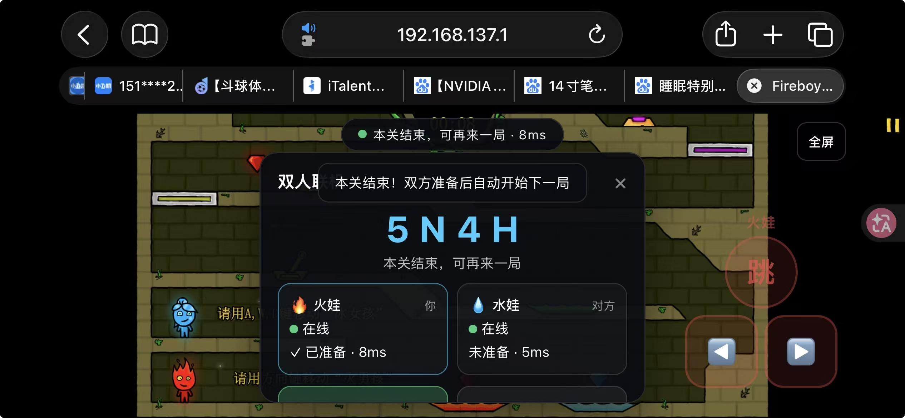
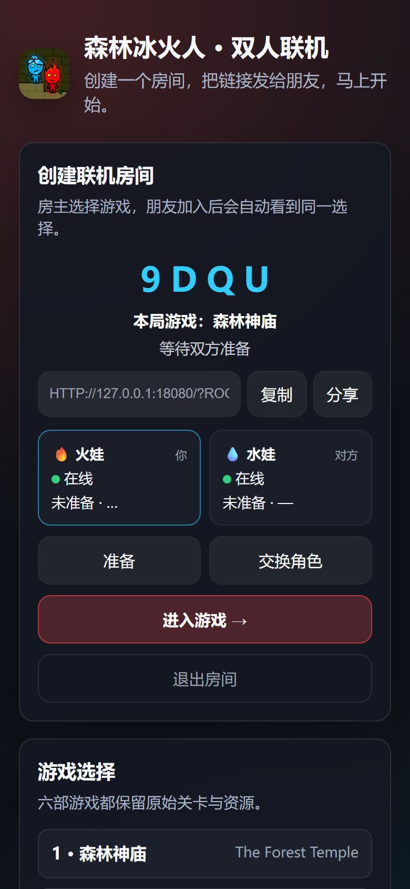
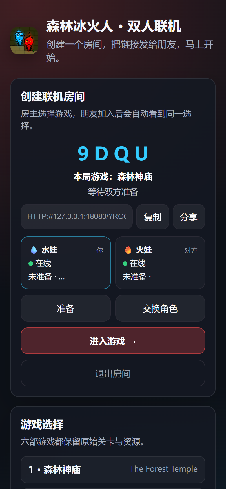
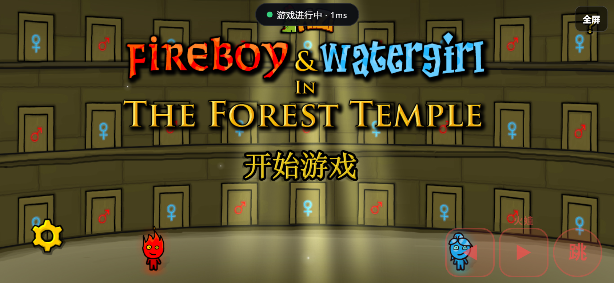
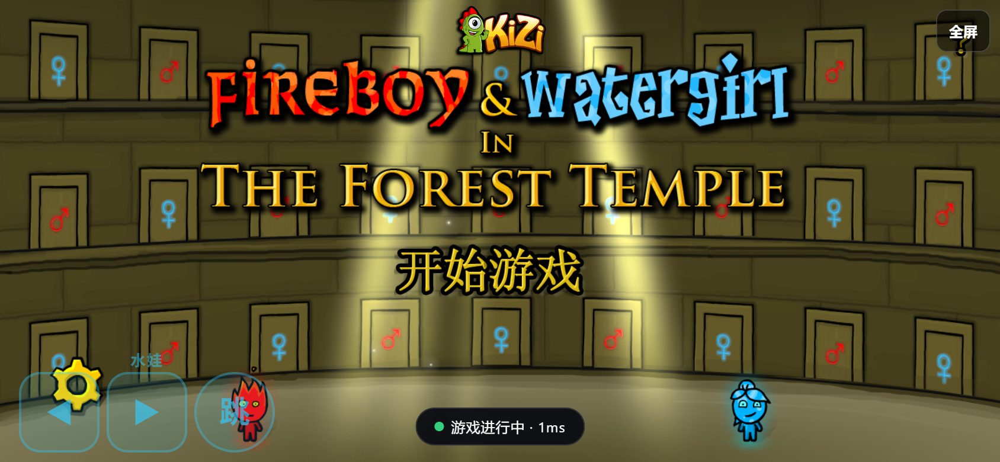

# Fireboy & Watergirl Phone

森林冰火人 1-6 的离线网页游戏与双人联机版本，支持桌面键盘、手机触控和同源 Socket.IO 联机。

## 手机端实测

手机端建议横屏使用。左右移动按钮位于左侧，跳跃按钮位于右侧，支持多指同时操作。



完整联机流程截图：

| 房主创建房间 | 第二台设备加入 |
| --- | --- |
|  |  |

进入游戏后，双方会分别显示自己的角色和触控区域：

| 房主进入游戏 | 加入者进入游戏 |
| --- | --- |
|  |  |

截图来自本地生产服务的真实浏览器联机流程，房间创建、加入、准备和进入游戏均为实际操作结果。

> iPhone Safari 不支持普通网页强制全屏。游戏页会提供“加入主屏幕”提示；从主屏幕启动后可以获得没有 Safari 地址栏的沉浸式体验。iPad 通常支持网页全屏按钮。

## 项目来源

本项目 fork 并基于以下原始仓库进行整理和扩展：

- 原始资源抓取仓库：[yezhiyi9670/fireboy-and-watergirl-grabber](https://github.com/yezhiyi9670/fireboy-and-watergirl-grabber)
- 游戏部署参考仓库：[1224HuangJin/Fireboy-and-Watergirl](https://github.com/1224HuangJin/Fireboy-and-Watergirl)

本仓库增加了六部游戏统一入口、移动端适配、统一输入管理、双人房间、断线恢复、Socket.IO 同步、Docker 和 HTTPS/WSS 部署配置。

## 游戏列表

| 编号 | 游戏 | 目录 |
| --- | --- | --- |
| 1 | Forest Temple / 森林神庙 | `games/1-forest-temple` |
| 2 | Light Temple / 光明神庙 | `games/2-light-temple` |
| 3 | Ice Temple / 寒冰圣殿 | `games/3-ice-temple` |
| 4 | Crystal Temple / 水晶殿 | `games/4-crystal-temple` |
| 5 | Elements / 元素 | `games/5-elements` |
| 6 | Fairy Tales / 童话 | `games/6-fairy-tales` |

## 本地运行

需要 Node.js 20 或更高版本。

```bash
npm install
npm --prefix server ci
npm --prefix server run dev
```

浏览器打开 <http://127.0.0.1:8080/>。静态托管可以运行单机游戏，但不提供房间和 Socket.IO 联机功能。

## 操作方式

桌面端：水娃使用 `W/A/D`，火娃使用 `↑/←/→`。

手机端横屏后，左侧两个按钮控制左右移动，右侧按钮控制跳跃，可以同时按住移动和跳跃。页面失焦、切后台或触控中断时，按键会自动释放。

联机流程：

1. 在大厅选择游戏和角色并创建房间。
2. 将四位房间码或邀请链接发给另一台设备。
3. 两名玩家加载完成后分别点击“准备”。
4. 服务端统一倒计时并开始游戏。
5. 短暂断线时，原座位会保留一段时间，刷新页面可恢复。

## 生产部署

项目提供 `Dockerfile`、`docker-compose.yml`、`deploy/nginx.conf.example` 和 `.env.example`。

```bash
cp .env.example .env
# 修改 PUBLIC_URL 和 ALLOWED_ORIGINS
docker compose up -d --build
```

Nginx 需要使用 HTTPS，并将 `/socket.io/` 原样转发到 Node 服务，同时转发 `Upgrade`、`Connection: upgrade` 和 `X-Forwarded-*` 请求头。Node 默认监听 8080，健康检查地址为 `/healthz`。

常用环境变量：`PORT`、`PUBLIC_URL`、`ALLOWED_ORIGINS`、`TRUST_PROXY`、`EMPTY_ROOM_TTL_MS`、`SEAT_GRACE_MS`、`MAX_ROOMS`、`RATE_CREATE_PER_MIN`、`RATE_JOIN_PER_MIN`、`RATE_MESSAGE_PER_MIN`。

## 测试

```bash
node games/lib/input/selftest.mjs
npm --prefix server test
npm run test:mobile
```

测试覆盖房间状态机、角色约束、断线恢复、旧回合隔离、payload 校验、限流、容量保护、移动端房间流程、触控输入和重连。

## 目录结构

```text
index.html                 # 联机大厅和游戏入口
games/                     # 六部游戏、共享资源和浏览器端模块
common/protocol/           # 浏览器和服务端共用协议
server/                    # Express 静态服务、房间状态机和 Socket.IO
tests/                     # 移动端浏览器 E2E 测试
deploy/                    # Nginx 配置示例
docs/mobile-gameplay.jpg   # 手机端实测截图
```

## 版权与使用提醒

本项目仅用于非商业学习、研究和测试。游戏名称、角色、音频、图片、关卡和其他素材的版权归其原作者或权利人所有。部署、分享或修改前请自行确认所在地区和使用场景的法律要求。

项目代码以 [MIT License](LICENSE) 发布，但该许可证不改变第三方游戏素材的权利归属。
